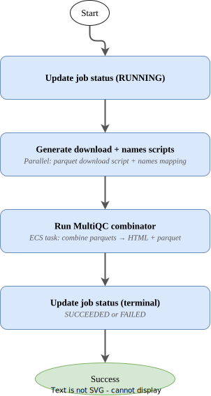

# Fastq Manager

- [Overview](#overview)
- [Job State Machines](#job-state-machines)
  - [1. Read Count Stats](#1-read-count-stats)
  - [2. QC Stats (Sequali)](#2-qc-stats-sequali)
  - [3. File Compression Stats](#3-file-compression-stats)
  - [4. NTSM Fingerprinting](#4-ntsm-fingerprinting)
  - [5. Somalier Extract](#5-somalier-extract)
  - [6. MultiQC Collector](#6-multiqc-collector)
- [Event Contract](#event-contract)
  - [Consumed Events](#consumed-events)
  - [Published Events](#published-events)
- [API Endpoints](#api-endpoints)
- [Infrastructure](#infrastructure)
  - [Stateful Resources](#stateful-resources)
  - [Stateless Resources](#stateless-resources)
  - [Stacks](#stacks)
- [CI/CD and Release Management](#cicd-and-release-management)
- [Related Services](#related-services)
- [SOPs](#sops)
- [Usage Examples](#usage-examples)
- [Glossary & References](#glossary--references)

## Overview

The Fastq Manager is a core OrcaBus service that serves as both a metadata database and a
RESTful API for managing FASTQ file records. It sits at the intersection of the File Manager
and Metadata Manager services, providing downstream pipeline services with a unified view of
sequencing data.

**Key design principles:**

- Stores File Manager **ingest IDs** rather than S3 URIs directly — decoupling storage location
  from file identity (files can be archived/moved and the reference remains valid)
- Each FASTQ record must be linked to a **library** and have a unique **RGID**
  (Read Group ID, typically `<index>.<lane>.<instrument_run_id>` for Illumina reads)
- FASTQ records are grouped into **Fastq Sets** for downstream consumption
- Supports both **gzip** and **ORA** compressed FASTQ files
- Uses [ULIDs](https://github.com/ulid/spec) with context prefixes for primary keys:
  `fqr.` (fastq records), `fqs.` (fastq sets), `fqj.` (jobs), `mqj.` (multiqc jobs)
- Publishes state change events to EventBridge whenever a fastq or fastq set is updated

**Jobs:** The Fastq Manager runs background jobs on FASTQ records via Step Functions:

| Job Type | Description |
|----------|-------------|
| Read Count | Calculate the number of reads in a FASTQ file |
| Base Count Estimate | Estimate the number of non-N bases |
| File Compression | Calculate raw md5sum and gzip file size (for ORA: estimated gzip size) |
| NTSM Fingerprint | Generate an [NTSM](https://github.com/JustinChu/ntsm) fingerprint for a fastq pair |
| QC Stats | Run [sequali](https://github.com/rhpvorderman/sequali) for quality metrics and generate MultiQC-compatible reports |
| Somalier Extract | Generate [somalier](https://github.com/brentp/somalier) fingerprints for sample identity verification |
| MultiQC Collector | Aggregate sequali parquet outputs into a combined MultiQC HTML report |

## Job State Machines

The service orchestrates nine Step Functions state machines. The primary job state machines
are described below.

### 1. Read Count Stats

State machine: [run_read_count_stats_sfn_template](app/step-functions-templates/run_read_count_stats_sfn_template.asl.json)


Counts the number of reads and estimates base counts for a FASTQ file. Handles both gzip and
ORA compressed files — ORA files are decompressed via an external service before counting.

Flow:
1. Fetch the FASTQ record and resolve S3 URIs
2. If read count is not already known, compute it (ECS task for gzip, external event for ORA)
3. If ORA, decompress a subset of reads for base count estimation
4. Run base count estimation via ECS
5. Update the job status and persist results to the FASTQ record

### 2. QC Stats (Sequali)

State machine: [run_qc_stats_sfn_template](app/step-functions-templates/run_qc_stats_sfn_template.asl.json)


Runs sequali quality metrics on a FASTQ pair and produces HTML + parquet reports for both
sequali and MultiQC formats.

Flow:
1. Fetch the FASTQ record and resolve S3 URIs
2. If ORA compressed: ensure read count exists (request sync if missing), then decompress a sample of reads
3. Calculate required ephemeral storage for the ECS task
4. Run sequali via ECS, producing JSON summary + HTML + parquet outputs
5. Update job status, sync outputs to File Manager, then update the FASTQ record with QC data

### 3. File Compression Stats

State machine: [run_file_compression_stats_sfn_template](app/step-functions-templates/run_file_compression_stats_sfn_template.asl.json)


Calculates raw md5sums and file sizes. For ORA files, delegates to the Fastq Decompression
Service to obtain estimated gzip sizes and raw md5sums. For gzip files, runs an ECS task per
file to stream-compute the raw md5sum.

Flow:
1. Fetch the FASTQ record and resolve S3 URIs
2. Branch by compression format:
   - **ORA**: request gzip file size and raw md5sum in parallel from the decompression service (wait for callback)
   - **GZIP**: map over each file, running an ECS task to compute raw md5sum
3. Update job status and persist file compression info to the FASTQ record

### 4. NTSM Fingerprinting

State machine: [run_ntsm_count_sfn_template](app/step-functions-templates/run_ntsm_count_sfn_template.asl.json)


Generates an NTSM fingerprint file for a FASTQ pair, used for sample identity verification
across runs.

Flow:
1. Fetch the FASTQ record and resolve S3 URIs
2. If ORA compressed, decompress via external service (wait for callback)
3. Run NTSM count via ECS
4. Update job status, sync fingerprint to File Manager, then update the FASTQ record

### 5. Somalier Extract

State machine: [run_somalier_extract_sfn_template](app/step-functions-templates/run_somalier_extract_sfn_template.asl.json)


Generates somalier fingerprints from a fastq set (or an input BAM), produces a mini-BAM aligned
to fingerprinting sites, and sends it to the Holmes service for extraction.

Flow:
1. Resolve reference genome and sites VCF paths from SSM
2. If a BAM URI is provided, extract directly from BAM; otherwise fetch fastq list from the set
3. If ORA compressed, decompress a subset of reads
4. Run ECS task to align reads to fingerprinting sites and generate somalier fingerprint + mini-BAM
5. Get library/individual metadata, send mini-BAM to Holmes extract
6. Update the fastq set record with the somalier URI

### 6. MultiQC Collector

State machine: [run_multiqc_collector_sfn_template](app/step-functions-templates/run_multiqc_collector_sfn_template.asl.json)



Aggregates sequali parquet outputs from multiple FASTQ records into a combined MultiQC report.

Flow:
1. Update MultiQC job status to RUNNING
2. In parallel: generate a download script for parquet files + generate a names mapping TSV
3. Run the MultiQC combinator ECS task to produce a combined HTML + parquet report
4. Update MultiQC job status to SUCCEEDED (or FAILED)

## Event Contract

### Consumed Events

The Fastq Manager consumes events from co-dependent services via `waitForTaskToken` callbacks:

| Event | Source | Purpose |
|-------|--------|---------|
| ORA decompression response | `orcabus.fastqdecompression` | Decompressed FASTQ file URIs for ORA files |
| Gzip file size response | `orcabus.fastqdecompression` | Estimated gzip size for ORA files |
| Raw md5sum response | `orcabus.fastqdecompression` | Raw md5sum for ORA files |
| Read count response | `orcabus.fastqdecompression` | Read count for ORA files |
| Fastq sync response | `orcabus.fastqsync` | Synced FASTQ metadata (read count etc.) |

### Published Events

| DetailType | Source | Status Values | Description |
|------------|--------|---------------|-------------|
| `FastqStateChange` | `orcabus.fastqmanager` | `FASTQ_CREATED`, `FASTQ_DELETED`, `READ_SET_ADDED`, `READ_SET_DELETED`, `FILE_COMPRESSION_UPDATED`, `QC_UPDATED`, `NTSM_UPDATED`, `READ_COUNT_UPDATED`, `LIBRARY_UPDATED`, `FASTQ_IS_VALID`, `FASTQ_IS_INVALID`, `FASTQ_SET_UPDATED` | A FASTQ record has been modified |
| `FastqSetStateChange` | `orcabus.fastqmanager` | `FASTQ_SET_CREATED`, `FASTQ_SET_DELETED`, `FASTQ_LINKED`, `FASTQ_UNLINKED`, `FASTQ_SET_IS_CURRENT`, `FASTQ_SET_IS_NOT_CURRENT`, `FASTQ_SET_ADDITIONAL_FASTQS_ALLOWED`, `FASTQ_SET_ADDITIONAL_FASTQS_DISALLOWED`, `FASTQ_SET_MERGED`, `SOMALIER_UPDATED` | A Fastq Set has been modified |
| `MultiqcJobStateChange` | `orcabus.fastqmanager` | `RUNNING`, `SUCCEEDED`, `FAILED` | A MultiQC aggregation job state update |

## API Endpoints

This service provides a RESTful API following OpenAPI conventions.

| Environment | Base URL | Swagger UI |
|-------------|----------|------------|
| Production | [https://fastq.prod.umccr.org/api/v1](https://fastq.prod.umccr.org/api/v1) | [Swagger](https://fastq.prod.umccr.org/schema/swagger-ui) |

Route conventions:
- `fqr` IDs → `/api/v1/fastq` endpoints
- `fqs` IDs → `/api/v1/fastqSet` endpoints
- RGID lookups → `/api/v1/rgid` endpoints
- MultiQC jobs → `/api/v1/multiqc` endpoints

## Infrastructure

The service is deployed via AWS CDK. Resources are split into stateful (data) and
stateless (compute/events) stacks.

Event bus: `OrcaBusMain`
Event source: `orcabus.fastqmanager`

### Stateful Resources

**DynamoDB Tables**

| Table | Purpose |
|-------|---------|
| FastqDataTable | FASTQ file records (metadata, QC, fingerprints) |
| FastqSetDataTable | Fastq set groupings and their properties |
| FastqJobsTable | Job tracking (status, timestamps) |

**S3 Buckets**

| Bucket | Purpose |
|--------|---------|
| `fastq-manager-cache-*` | Temporary outputs from ECS tasks (read counts, md5sums, sequali JSON) |
| `ntsm-fingerprints-*` | NTSM fingerprint files and somalier outputs |
| Sequali output bucket | Sequali/MultiQC HTML and parquet reports |

### Stateless Resources

- **API Gateway** + Lambda (FastAPI via Mangum)
- **Lambda functions** (Python 3.x, ARM64) — one per task; see [app/lambdas/](app/lambdas)
- **Step Functions** — nine ASL templates in [app/step-functions-templates/](app/step-functions-templates)
- **ECS tasks** (Fargate) — bioinformatics containers for md5sum, read count, base count, NTSM, sequali, somalier, MultiQC
- **EventBridge rules** — route callback events to state machines

### Stacks

The CDK project deploys a CodePipeline in the toolchain account that promotes changes
to `beta`, `gamma`, and `prod`.

```sh
# List stateful stacks
pnpm cdk-stateful ls

# List stateless stacks
pnpm cdk-stateless ls
```

## CI/CD and Release Management

All changes merged to `main` are automatically built and deployed via CodePipeline.
GitHub Actions run lint/security checks and CDK nag tests on pull requests.

## Related Services

| Relationship | Service | Purpose |
|--------------|---------|---------|
| Upstream | [File Manager](https://github.com/OrcaBus/service-filemanager) | Source of file ingest IDs and S3 storage metadata |
| Upstream | [Metadata Manager](https://github.com/OrcaBus/service-metadata-manager) | Source of library/subject metadata |
| Co-dependent | [Fastq Decompression](https://github.com/OrcaBus/service-fastq-decompression-manager) | ORA → gzip decompression, gzip size estimation, raw md5sum |
| Co-dependent | [Fastq Sync](https://github.com/OrcaBus/service-fastq-sync-manager) | Sync external metadata (read counts) into fastq records |
| Co-dependent | [Fastq Unarchiving](https://github.com/OrcaBus/service-fastq-unarchiving-manager) | Restore archived FASTQ files from Glacier |
| Co-dependent | [Fastq Glue](https://github.com/OrcaBus/service-fastq-glue) | Bridge between fastq sets and pipeline draft events |
| Downstream | [Data Sharing](https://github.com/OrcaBus/service-data-sharing-manager) | Shares FASTQ data with external collaborators |
| Downstream | [Dragen WGTS DNA Pipeline](https://github.com/OrcaBus/service-dragen-wgts-dna-pipeline-manager) | Alignment and variant calling pipeline |
| Downstream | [Dragen TSO500 ctDNA Pipeline](https://github.com/OrcaBus/service-dragen-tso500-ctdna-pipeline-manager) | ctDNA analysis pipeline |

## SOPs

| ID | Description |
|----|-------------|
| [FQM.1](docs/operation/sop/FQM.1/FQM.1-InvalidateFastqPair.md) | Invalidate a Fastq Pair |

## Usage Examples

See the full [usage examples](docs/operation/Examples.md) document for curl/httpie recipes:

- [Setup: Authentication](docs/operation/Examples.md#setup-authentication)
- [Get Fastqs](docs/operation/Examples.md#get-fastqs-apiv1fastq)
- [Get Fastq by RGID](docs/operation/Examples.md#get-fastq-by-rgid-apiv1rgid)
- [Get Fastq Sets](docs/operation/Examples.md#get-fastq-sets-apiv1fastqset)
- [Run Jobs on Fastqs](docs/operation/Examples.md#run-jobs-on-fastqs)
- [Creating Fastq Objects](docs/operation/Examples.md#creating-fastq-objects)
- [Deleting Fastq Objects](docs/operation/Examples.md#deleting-fastq-objects)
- [MultiQC Summaries](docs/operation/Examples.md#multiqc-summaries)

## Glossary & References

- Platform glossary: [OrcaBus wiki](https://github.com/OrcaBus/wiki/blob/main/orcabus-platform/README.md#glossary--references)
- For development setup, build commands, project structure, and conventions see
  the [steering docs](.kiro/steering).

| Term | Description |
|------|-------------|
| Fastq (fqr) | A single FASTQ file record, linked to a library |
| Fastq Set (fqs) | A grouping of FASTQ records consumed by downstream pipelines |
| RGID | Read Group ID — unique identifier per fastq (`<index>.<lane>.<instrument_run_id>`) |
| Read Set | A pair of FASTQ files (R1 required, R2 optional) |
| NTSM | Non-Trivial Sample Matching — fingerprinting tool for sample identity |
| Somalier | Tool for checking sample identity via extracted genotype sites |
| ORA | Illumina's proprietary FASTQ compression format |
| ULID | Universally Unique Lexicographically Sortable Identifier |
