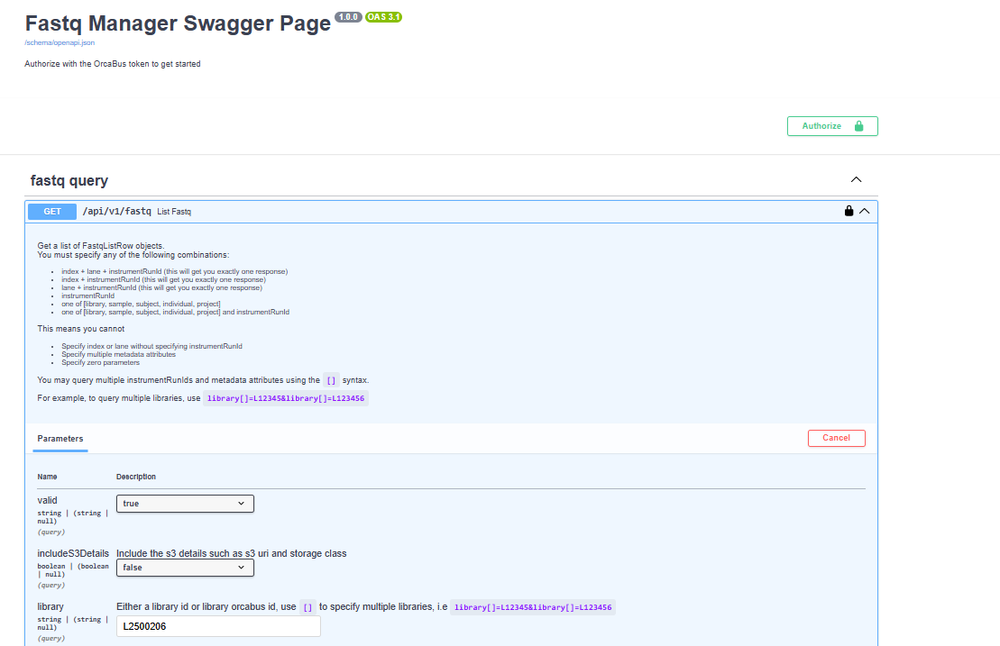
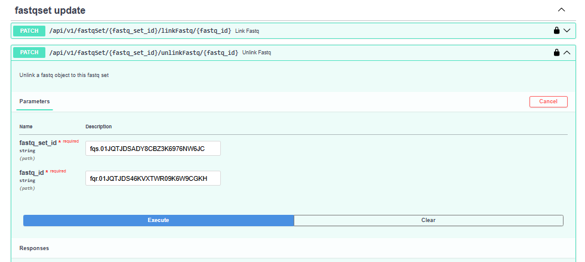
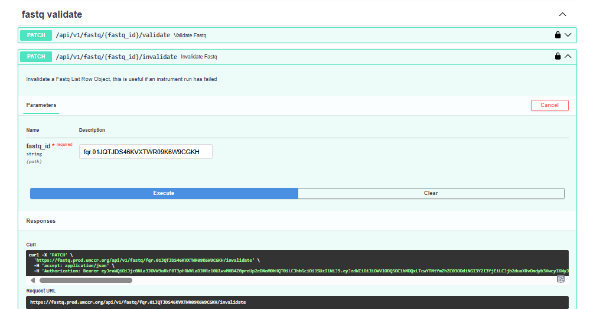

# FQM.1 - Invalidate Fastq Pair

## Introduction

When FASTQs become no longer valid, which can happen due to a number of reasons, we want to exclude them from the production system. This prevents them from accidentally be used again.

The "invalidation" this document refers to primarily concerns the change of metadata in the Fastq Manager's records indicating that a particular FASTQ pair is no longer valid. While this prevents OrcaBus internal services relying on the Fastq Manager to use no longer valid data, it does not remove the actual FASTQ files themselves.

The actual file removal is independent of the invalidation and subject to other SOPs.

## Procedure

The required operations are to be performed via the service's [API](../../../../README.md#api-endpoints).

Steps to follow:

### Identify the ID of the FASTQ pair (fqr)

This will provide the ID (fqr.xxx) of the FASTQ pair record and the ID of the Fastq Set (fqs.xxx) the FASTQ is part of. These details are needed for the next steps.

UI (swagger):



Command line:

```
curl -X 'GET' \
  'https://fastq.prod.umccr.org/api/v1/fastq?library=L2500206' \
  -H 'accept: application/json' \
  -H 'Authorization: Bearer <ACCESS TOKEN>'
```

### Unlink the ID from the Fastq Set (fqs)

This action will remove the FASTQ from the set (a pre-requisite before invalidating the FASTQ itself).

UI (swagger):



Command line:

```
curl -X 'PATCH' \
  'https://fastq.dev.umccr.org/api/v1/fastqSet/fqs.012345678900EXAMPLE0000001/unlinkFastq/fqr.012345678900EXAMPLE0000002' \
  -H 'accept: application/json' \
  -H 'Authorization: Bearer <ACCESS TOKEN>'
```

### Invalidate the FASTQ pair

This will invalidate the FASTQ marking it as no longer valid (not to be used even if it still exists).

UI (swagger):



Command line:

```
  curl -X 'PATCH' \
  'https://fastq.dev.umccr.org/api/v1/fastq/fqr.012345678900EXAMPLE0000002/invalidate' \
  -H 'accept: application/json' \
  -H 'Authorization: Bearer  <ACCESS TOKEN>'
```
